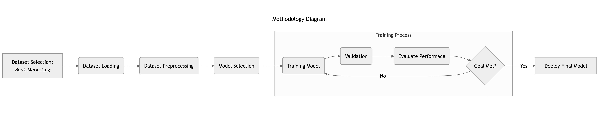

# ARTI 308 - Machine Learning

Problem Description
===================
The goal of this repository is to predict whether a client will subscribe to a bank term deposit using marketing campaign data from a Portuguese banking institution.

Problem Categorization
======================
* **Task Type:** Classification.
* **Learning Type:** Supervised Learning.
* **Target Variable:** `y`, a binary categorical variable indicating whether the client subscribed to a term deposit (`yes` or `no`).


Setup Instructions
==================
1. Clone this repository.
2. Install the dependencies:
```bash
pip install -r requirements.txt
```

Methodology Diagram
===================


Dataset Attribution
===================
The dataset is retrieved from the UCI Machine Learning Repository: [Bank Marketing Dataset](https://archive.ics.uci.edu/dataset/222/bank+marketing), licensed under a [Creative Commons Attribution 4.0 International](https://creativecommons.org/licenses/by/4.0/legalcode) (CC BY 4.0) license.
